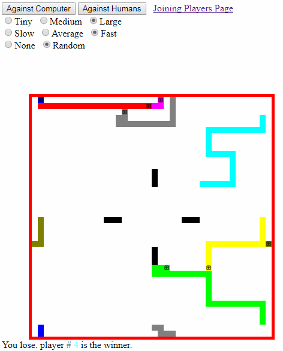
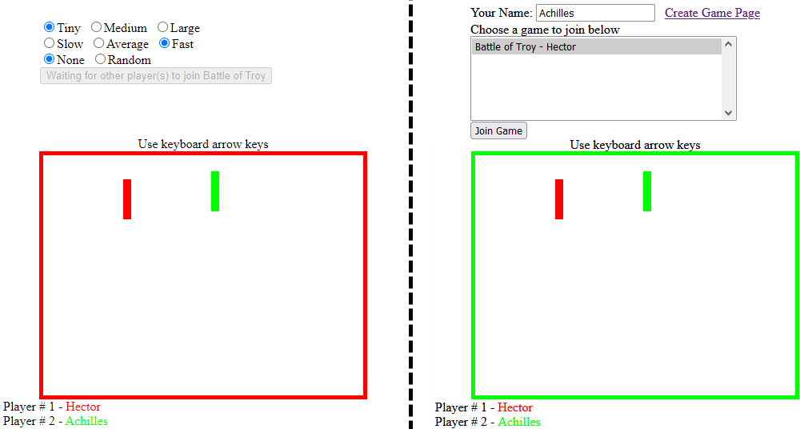

Electric-Snakes, [https://electric-snakes.herokuapp.com](https://electric-snakes.herokuapp.com/create-game) a slow to start free site, is a multi-computer snake game server, written in Typescript, using Redux and Immutable.js to hold state.
Interactions are synchronized via WebSockets between the single coordinating Node.js server and possibly several Javascript browsers.
The server is a free Heroku dyno, so it can take a few seconds to wake up.

A single player game against seven computer players

A two player game, called "Battle of Troy" [started](https://electric-snakes.herokuapp.com/create-game) by "Hector" with "Achilles" [joining](https://electric-snakes.herokuapp.com/join-game).
One person "creates" and names the game. While others can join in.

### Prepare Environment

- nvm install 18.2.0

- nvm use 18.2.0

### Compile all and run from scratch:

    $ npm install
    $ npx tsc
    $ npx webpack-cli
    $ npm start  or  npm test

### Run program

    $ npm start
